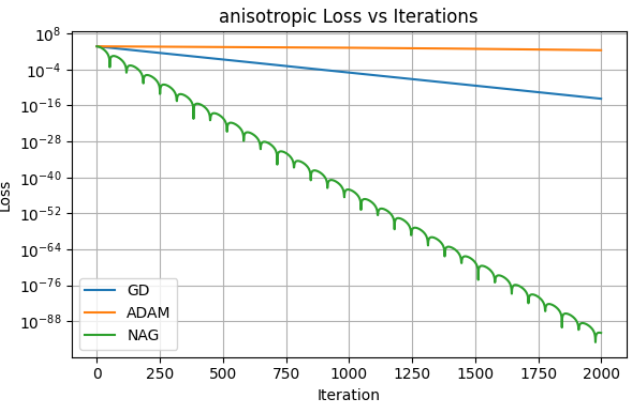
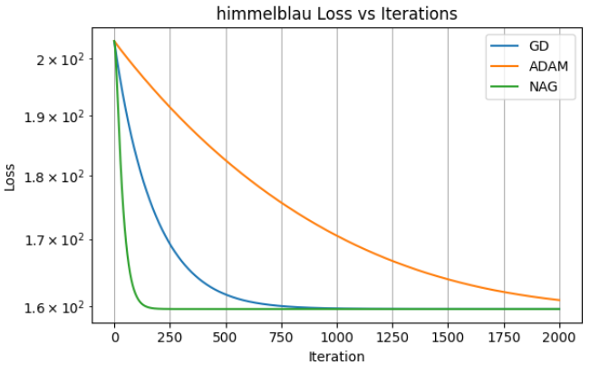
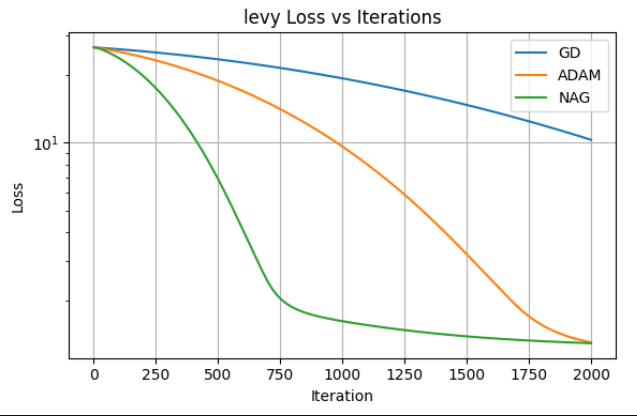
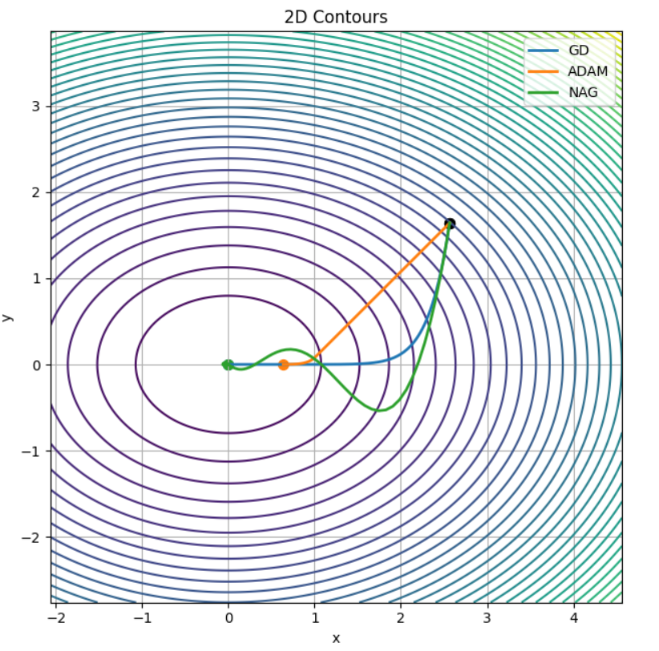
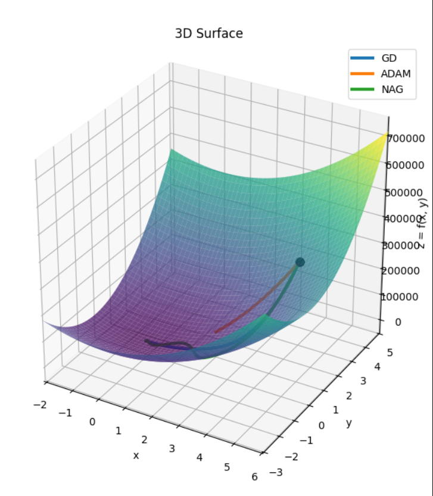
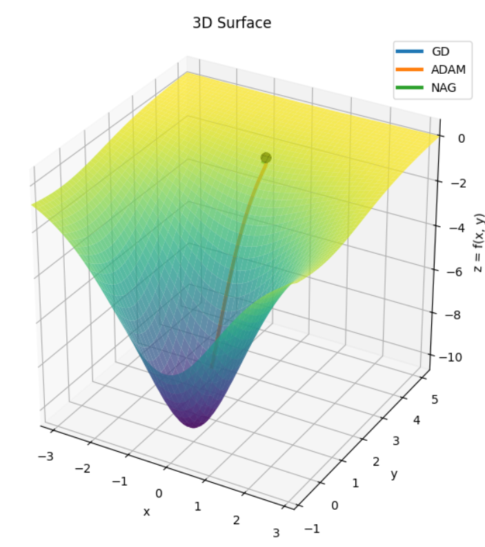

# 🚀 Benchmarking Optimization Algorithms (SGD, Momentum, NAG)

## 🌟 Project Highlights

✔ Implemented core optimization algorithms from scratch (no ML libraries)  
✔ Visualized optimizer trajectories on complex non-convex loss surfaces  
✔ Benchmarked convergence speed and stability across multiple functions  
✔ Compared SGD, Momentum, and Nesterov Accelerated Gradient (NAG)  
✔ Demonstrated practical understanding of gradient dynamics in ML  

---

## 📌 Overview

This project benchmarks and compares the performance of different gradient-based optimization algorithms used in machine learning. The goal is to analyze how quickly and effectively each optimizer converges while minimizing loss.

The optimizers implemented and evaluated in this project include:

- Stochastic Gradient Descent (SGD)
- Momentum
- Nesterov Accelerated Gradient (NAG)

---

## 🎯 Objective

The main objectives of this project are:

- To implement core optimization algorithms from scratch  
- To compare their convergence behaviour  
- To analyze optimization speed and stability  
- To visualize loss reduction across iterations  

---

## ⚙️ Optimizers Implemented

### 1. Stochastic Gradient Descent (SGD)
The basic optimization algorithm that updates parameters using the gradient of the loss function.

### 2. Momentum
Momentum accelerates SGD by accumulating past gradients to smooth updates and reduce oscillations.

### 3. Nesterov Accelerated Gradient (NAG)
NAG improves momentum by computing the gradient at the “look-ahead” position, resulting in faster and more informed updates.

---

## 🧮 Mathematical Formulation

Let θ be model parameters and L(θ) be the loss function.

**SGD update:**

θ = θ − η ∇L(θ)

**Momentum update:**

vₜ = γ vₜ₋₁ + η ∇L(θ)  
θ = θ − vₜ

**Nesterov Accelerated Gradient (NAG):**

vₜ = γ vₜ₋₁ + η ∇L(θ − γ vₜ₋₁)  
θ = θ − vₜ

---

## 🧪 Experimental Setup

- Language: Python  
- Libraries: NumPy, Matplotlib  
- Training approach: Iterative gradient updates  
- Evaluation metric: Loss vs iterations  

---

## 🧪 Benchmark Functions

The optimizers were evaluated on standard non-convex test functions:

- **Himmelblau Function** – multiple local minima  
- **Levy Function** – highly complex landscape  
- **Anisotropic Function** – ill-conditioned curvature  
- **Matérn Function** – smooth but non-trivial surface  

---

## 📊 Results & Visualization

### Loss vs Iterations

#### Anisotropic Function


#### Himmelblau Function


#### Levy Function


---

### Optimization Paths

#### Anisotropic Surface


#### Himmelblau Surface


#### Matérn Surface


---

## 📊 Quantitative Results (Sample Summary)

| Optimizer | Function    | Iterations to Converge | Final Loss | Stability |
|------------|-------------|------------------------|------------|-----------|
| SGD        | Himmelblau  | ~1800                  | Low        | Medium    |
| Momentum   | Himmelblau  | ~950                   | Lower      | High      |
| NAG        | Himmelblau  | ~375                   | Lowest     | High      |

---

## 🔍 Key Observations

- NAG converges faster compared to SGD and Momentum  
- Momentum provides smoother convergence than SGD  
- SGD is simple but slower in reaching optimal loss  
- NAG’s look-ahead gradient leads to better trajectory planning  
- Performance gain is more visible on ill-conditioned surfaces  

---

## 🤔 When to Use Which Optimizer?

- **SGD** → Simple problems, low memory usage  
- **Momentum** → Noisy gradients, oscillating loss surfaces  
- **NAG** → Faster convergence and better directional awareness  

---

## 📁 Project Structure

```
Benchmark-estimation-optimizers/
│
├── notebooks/
│   └── benchMark-OPTMISER.ipynb    
│
├── results/
│   ├── loss-iteration/        
│   └── paths/                  
│
└── README.md                  
```


## 🚀 Future Improvements

- Add Adam and RMSProp optimizers
- Compare performance across different learning rates
- Benchmark on real datasets (e.g., MNIST)
- Measure computation time vs accuracy trade-off

---

## 💼 Relevance

This project demonstrates practical understanding of:

- Optimization in Machine Learning
- Gradient-based learning methods
- Performance benchmarking
- Numerical experimentation and analysis


---

## 👨‍💻 Author

**Vishnu Vardhan Kasireddy**  
GitHub: https://github.com/VishnuVardhanKasireddy

---

## ⭐ If you found this useful
Give the repo a star ⭐ and feel free to fork or contribute!
